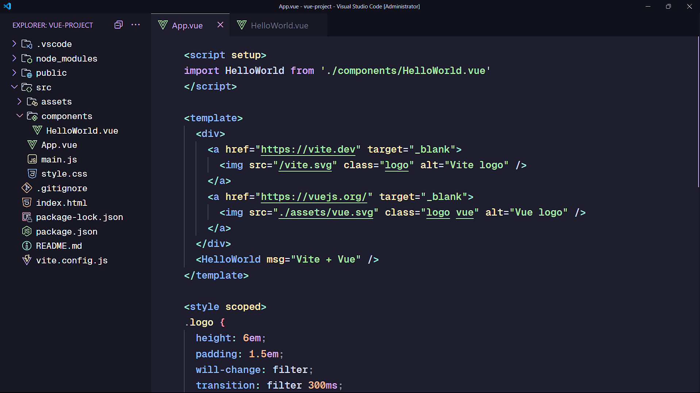

# VSCODE Settings

This is my personal Visual Studio Code settings which is cleaner than the default settings, I think 😆⚙️

## Applying Settings

Each command will backup your old settings in case you need it later. Start applying settings based on your OS:

### Windows

```powershell
code --install-extension Catppuccin.catppuccin-vsc; code --install-extension Catppuccin.catppuccin-vsc-icons; mv $env:APPDATA/Code/User/settings.json $env:APPDATA/Code/User/settings.json.bak; irm "https://github.com/samithseu/vscode-settings/raw/main/settings.json" -OutFile $ENV:APPDATA/code/user/settings.json
```

### Mac

```bash
code --install-extension Catppuccin.catppuccin-vsc && code --install-extension Catppuccin.catppuccin-vsc-icons && mv $HOME/Library/Application\ Support/Code/User/settings.json $HOME/Library/Application\ Support/Code/User/settings.json.bak && curl -o $HOME/Library/Application\ Support/Code/User/settings.json https://github.com/samithseu/vscode-settings/raw/main/settings.json
```

### Linux

```bash
code --install-extension Catppuccin.catppuccin-vsc && code --install-extension Catppuccin.catppuccin-vsc-icons && mv $HOME/.config/Code/User/settings.json $HOME/.config/Code/User/settings.json.bak && curl -o $HOME/.config/Code/User/settings.json https://github.com/samithseu/vscode-settings/raw/main/settings.json
```

## Result


