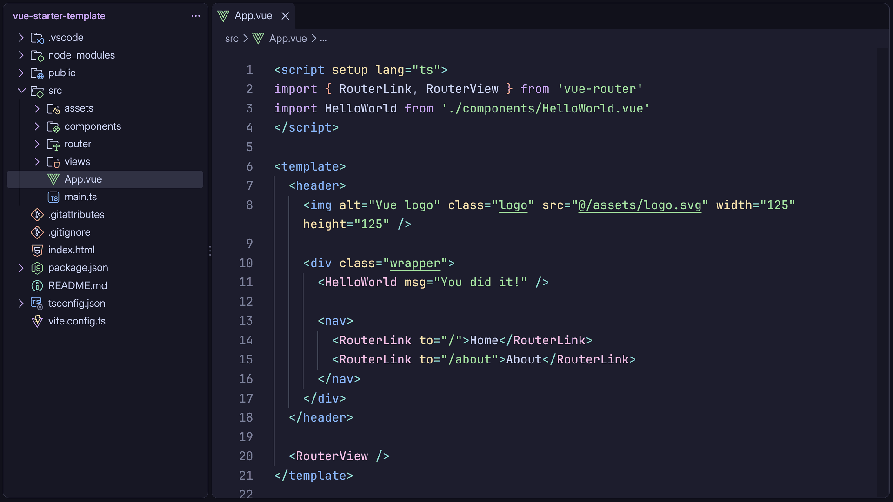

# VSCODE Settings

⚙️ This is my personal Visual Studio Code settings which is cleaner than the default settings, I think 😆

## Fonts

- English: <a href="https://github.com/ryanoasis/nerd-fonts/releases/download/v3.5.1/JetBrainsMono.zip" alt="JetBrainsMono Nerd Font">JetBrainsMono Nerd Font</a> <i>(Or choose the one you prefer!)</i>
- Khmer: <a href="https://github.com/grab/inter-font-extensions/releases/download/1.0/inter-font-extensions-1.0.zip" alt="Inter Khmer Looped">Inter Khmer Looped</a>

## Applying Settings

Start applying settings based on your OS: <i>(Each command will backup your old settings in case you need it later.)</i>

### Linux

```bash
code --install-extension esbenp.prettier-vscode && code --install-extension Catppuccin.catppuccin-vsc && code --install-extension Catppuccin.catppuccin-vsc-icons && [ -f "$HOME/.config/Code/User/settings.json" ] && mv "$HOME/.config/Code/User/settings.json" "$HOME/.config/Code/User/settings.json.bak" || echo "settings.json not found, skipping backup" && curl -L -o "$HOME/.config/Code/User/settings.json" "https://github.com/samithseu/vscode-settings/raw/main/settings.json" && curl -L -o "$HOME/.config/Code/User/keybindings.json" "https://github.com/samithseu/vscode-settings/raw/main/keybindings.json"
```

### Mac

```bash
code --install-extension esbenp.prettier-vscode && code --install-extension Catppuccin.catppuccin-vsc && code --install-extension Catppuccin.catppuccin-vsc-icons && [ -f "$HOME/Library/Application Support/Code/User/settings.json" ] && mv "$HOME/Library/Application Support/Code/User/settings.json" "$HOME/Library/Application Support/Code/User/settings.json.bak" || echo "settings.json not found, skipping backup" && curl -L -o "$HOME/Library/Application Support/Code/User/settings.json" "https://github.com/samithseu/vscode-settings/raw/main/settings.json" && curl -L -o "$HOME/Library/Application Support/Code/User/keybindings.json" "https://github.com/samithseu/vscode-settings/raw/main/keybindings.json"
```

### Windows

```powershell
code --install-extension esbenp.prettier-vscode; code --install-extension Catppuccin.catppuccin-vsc; code --install-extension Catppuccin.catppuccin-vsc-icons; if (Test-Path "$env:APPDATA\Code\User\settings.json") { mv "$env:APPDATA\Code\User\settings.json" "$env:APPDATA\Code\User\settings.json.bak" } else { Write-Host "settings.json not found, skipping backup" }; irm "https://github.com/samithseu/vscode-settings/raw/main/settings.json" -OutFile "$env:APPDATA\Code\User\settings.json"; irm "https://github.com/samithseu/vscode-settings/raw/main/keybindings.json" -OutFile "$env:APPDATA\Code\User\keybindings.json"
```

## Result

<figure>
  
  <figcaption>Screenshot of fullscreen mode in vscode on Fedora</figcaption>
</figure>

## Other

<details>
  <summary>Personal extensions only! <i>(optional)</i> </summary>
  
  ```bash
  echo "antfu.goto-alias
antfu.slidev
astro-build.astro-vscode
bradlc.vscode-tailwindcss
catppuccin.catppuccin-vsc
catppuccin.catppuccin-vsc-icons
continue.continue
csstools.postcss
dart-code.dart-code
dart-code.flutter
davidanson.vscode-markdownlint
dbaeumer.vscode-eslint
dsznajder.es7-react-js-snippets
ecmel.vscode-html-css
esbenp.prettier-vscode
github.codespaces
github.vscode-github-actions
golang.go
goopware.raythis
jkjustjoshing.vscode-text-pastry
jock.svg
ms-python.debugpy
ms-python.python
ms-python.vscode-pylance
ms-python.vscode-python-envs
ms-toolsai.jupyter
ms-toolsai.jupyter-keymap
ms-toolsai.jupyter-renderers
ms-toolsai.vscode-jupyter-cell-tags
ms-toolsai.vscode-jupyter-slideshow
myriad-dreamin.tinymist
naumovs.color-highlight
nuxt.mdc
nuxtr.nuxt-vscode-extentions
nuxtr.nuxtr-vscode
quicktype.quicktype
qwtel.sqlite-viewer
robert-brunhage.flutter-riverpod-snippets
rust-lang.rust-analyzer
sleistner.vscode-fileutils
streetsidesoftware.code-spell-checker
tamasfe.even-better-toml
tauri-apps.tauri-vscode
tomoki1207.pdf
vscjava.vscode-gradle
vue.volar
yoavbls.pretty-ts-errors
" | xargs -n 1 code --install-extension
  ```
</details>
